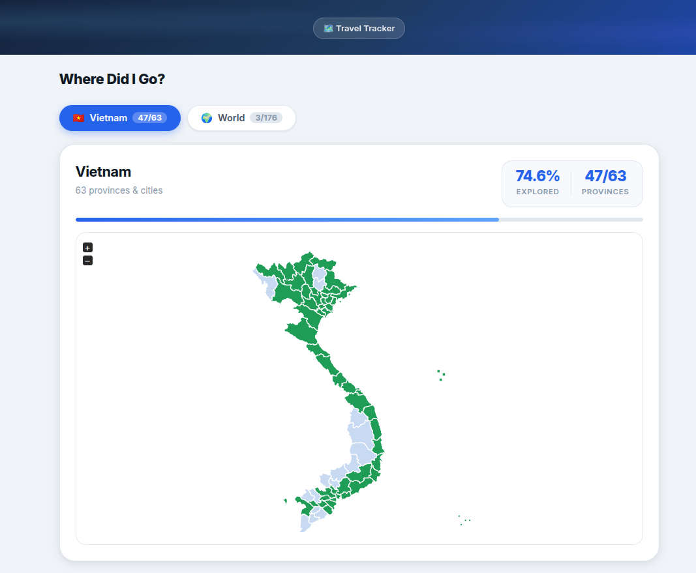

# 🗺️ Where Did I Go?

A lightweight, static travel tracker that lets you visualize which Vietnamese provinces and world countries you have visited — rendered as interactive maps with progress stats.

**[Live Demo →](https://travel.hoangviet.io.vn/)** *(replace with your deployed URL)*



---

## Features

- **Interactive Vietnam map** — all 63 provinces & cities, including Hoàng Sa (Đà Nẵng) and Trường Sa (Khánh Hòa) island territories
- **Interactive World map** — 176 countries
- Progress bars, donut charts, and visit counters for both maps
- Full place list with visited / not-visited styling
- Pure static files — no build step, no backend, no database
- One JSON file to edit: `visited.json`

---

## Getting Started

### 1. Clone the repo

```bash
git clone https://github.com/your-username/WhereDidIGo.git
cd WhereDidIGo
```

### 2. Mark your visited places

Open `visited.json` and set `"visited": true` for each place you've been to:

```json
{
  "vietnam": [
    { "place": "Hà Nội",   "visited": true  },
    { "place": "Hải Phòng","visited": false }
  ],
  "world": [
    { "code": "VN", "place": "Vietnam",  "visited": true  },
    { "code": "JP", "place": "Japan",    "visited": false }
  ]
}
```

### 3. Run locally

Any static file server works:

```bash
# Python (built-in)
python3 -m http.server 8080

# Node.js (npx)
npx serve .
```

Then open [http://localhost:8080](http://localhost:8080).

> **Note:** You must use a server — opening `index.html` directly as `file://` will block the `fetch("./visited.json")` call.

---

## Deploying

### Cloudflare Workers (recommended — free tier)

```bash
# Install Wrangler CLI
npm install -g wrangler

# Log in to Cloudflare
wrangler login

# Deploy
wrangler deploy

# Local preview with Cloudflare runtime
wrangler dev
```

Configuration is in [`wrangler.toml`](wrangler.toml). The worker in [`worker.js`](worker.js) proxies all requests to Cloudflare's static asset pipeline.

### GitHub Pages / Netlify / Vercel

Just point the service at the repo root — no build command needed.

---

## Project Structure

```
WhereDidIGo/
├── index.html          # App shell
├── styles.css          # All styling
├── script.js           # Map logic & data rendering
├── visited.json        # ← Edit this to track your travels
├── worker.js           # Cloudflare Worker entry point
├── wrangler.toml       # Cloudflare deployment config
└── vendor/
    ├── jsvectormap.min.js   # jsVectorMap library
    ├── jsvectormap.min.css
    ├── vietnam.js           # Vietnam map paths (63 provinces + islands)
    ├── world.js             # World map paths
    └── world-countries.js   # Country code → name lookup
```

---

## Customization

### Adding a new visited place

Edit `visited.json` — set `"visited": true`. No code changes required.

### Vietnam island territories

**Hoàng Sa** and **Trường Sa** are rendered as dot clusters on the Vietnam map. Their visited state is inherited automatically:
- Hoàng Sa is highlighted when **Đà Nẵng** is marked visited
- Trường Sa is highlighted when **Khánh Hòa** is marked visited

### Changing map colors

Edit the `MAP_STYLE` object at the top of `script.js`:

```js
const MAP_STYLE = {
  initial:       { fill: "#c8d9f2" },   // unvisited province color
  selected:      { fill: "#1f9d57" },   // visited province color
  selectedHover: { fill: "#1f9d57" },
};
```

---

## Tech Stack

| Library | Purpose |
|---------|---------|
| [jsVectorMap](https://github.com/themustafaomar/jsvectormap) | SVG map rendering |
| Vanilla JS (ES2020) | App logic — no framework |
| CSS custom properties | Design tokens & theming |
| Cloudflare Workers Assets | Static hosting |

---

## Contributing

Contributions are welcome! Some ideas:

- Add more map layers (e.g. districts within a province)
- Import from travel apps (Polarsteps, TripAdvisor, etc.)
- Dark mode toggle
- Share / export visited stats as an image

Please open an issue first to discuss significant changes.

---

## License

[MIT](LICENSE) — free to use, modify, and distribute.
